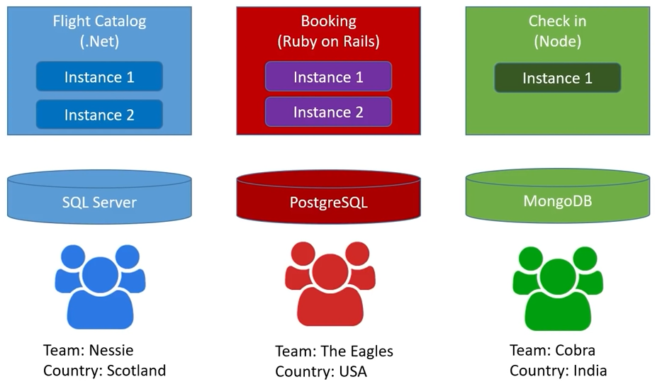
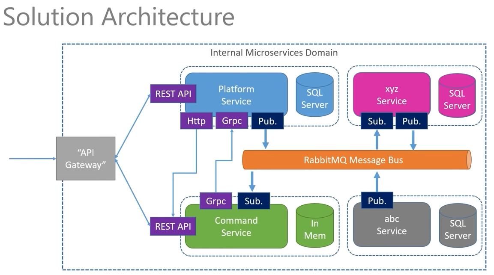
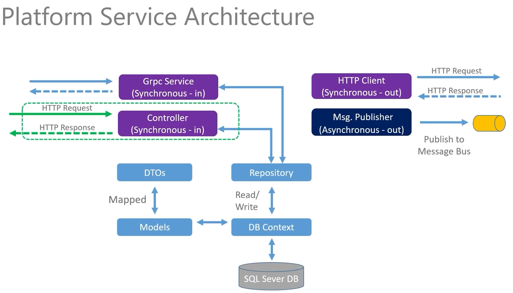
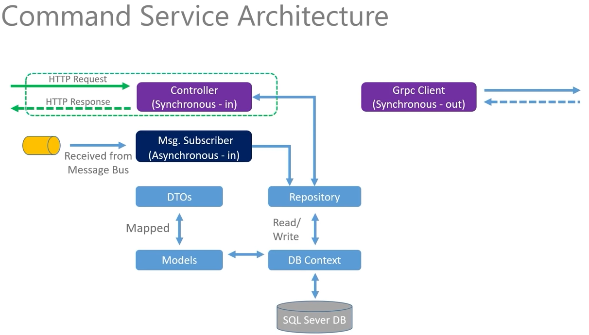
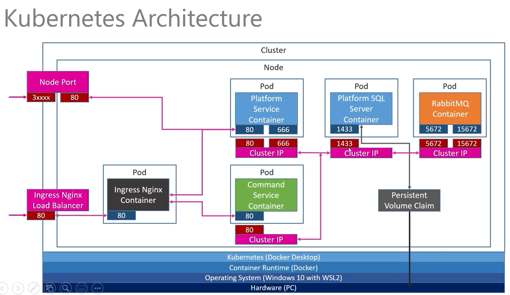

# Tech used in this tutorial:

## 1. Command Service

## 2. Scaffolding

## 3. Controller & Action

## 4. Synchronous & Asynchoronous Messaging

## 5. Adding a HTTP Client

## 6. Deploy Service to Kubernetes

## 7. Internal Networking

## 8. API Gateway

<br>

# SQL Server

## 1. Persistent Volume Claims

## 2. Kubernetes Secrets

## 3. Deploy SQL Server to Kubernetes

## 4. Revisit Platform Service

<br>

# Multi-Resource API

## 1. Review of Endpoints for Command Service

## 2. Data Layer

## 3. Controller & Actions

<br>

# Message Bus / RabbitMQ

## 1. Solution Architecture Review

## 2. RabbitMQ Overview

## 3. Deploy RabbitMQ to Kubernetes

## 4. Test

<br>

# Asynchronous Messaging

## 1. Adding a Message Bus Publisher to Platform Service

## 2. Event Processing

## 3. Adding an Event Listner to the Commands Service

<br>

# GRPC

## 1. Overview of GRPC

## 2. Final Kubernetes Networking

## 3. Adding gRPC server to Platform Service

## 4. Creating a "proto" file

## 5. Adding a gRPC client to the Command Service

## 6. Deploy and Test

<hr><hr><hr><br>

# Mircoservices

Microservices are designed to do one thing well while talking to other microservices. They are self-contained and autonomous. They are small and decoupled (easier to change and deploy). Resilient, one service breaks, the system continues to work. Scalable, you can scale only the services you need. They share data, but not the same database.`<br><br>`
A Monolith CRM system is very difficult to change (months of time with massive amount of manual testing), difficult to scale (you can scale but you need to scale the whole system). And they are locked in to the tech stack, making it difficult to change the tech. One part breaks, the whole system goes down.`<br><br>`



## In this tutorial we build 2 services:

<ol>
    <li>
        Platform Service
    </li>
    <ul>
        <li>
            Functions as an "Asset Register"
        </li>
        <li>
            Track all the platforms/systems in the company
        </li>
        <li>
            Built by the Infrastructure team
        </li>
        <li>
            Used by: Infrastructure, Tech support, Engineering, Accounting, Procurement teams
        </li>
    </ul>
</ol>
<ol>
    <li>
        Command Service
    </li>
    <ul>
        <li>
            Functions as a repository of command line augments for given Platforms
        </li>
        <li>
            Aid in the automation of support processes
        </li>
        <li>
            Built by the tech support team
        </li>
        <li>
            Used by: Tech support, Insfrastructure, Engineering teams
        </li>
    </ul>
</ol>
<br><br>




`<br><br>`

# Docker

**To build your image into docker, after making the dockerfile run:**

```
docker build -t parhambrz/platformservice .

```

**To run the docker image:**

```
docker run -p 8080:80 -d parhambrz/platformservice

```

-p: map port 8080 on docker to port 80 on local machine. This port can be used in the APIs like:

```
http://localhost:8080/api/platforms
```

-d: detached. You can then use terminal instead of seeing container logs.
**To show the list of running containers:**

```
docker ps

```

This gives a list of running containers with id. You can use the id to stop the container:

```
docker stop CONTAINER_ID

```

If you run the same image with "docker run ..." a new container will be created based on that image. To start the same stopped container run:

```
docker start CONTAINER_ID

```

**To push the image to DockerHub:**

```
docker push parhambrz/platformservice
```

In case you got error of push denied: Request access to the source is denied, you should login to docker using:

```
docker login
```

Then login with your dockerhub username and password.

# Kubernetes

One cluster can have multiple nodes.
Pod can run multiple containers. Pod is to host and run containers. Pod is the first level object we work with.
Node Port is the first k8s service used only in development to access to the pods from outside.
Cluster IP is used by the pods to talk to each other.
Load Balancer(Nginx) is another K8S service.
Persistent Volume Claim is used to claim some storage on physical device. e.g. the databases running in docker can store their data in PVC.

## Kubernetes Architecture of the tutorial:



**To run the application in Kubernetes:**

1. Create .yaml file (we created platform-depl.yaml)

   ```
   apiVersion: apps/v1
   kind: Deployment
   metadata:
     name: platform-depl
   spec:
     replicas: 1
     selector:
       matchLabels:
         app: platformservice
     template:
       metadata:
         labels:
           app: platformservice
       spec:
         containers:
           - name: platformservice
             image: parhambrz/platformservice:latest
   ```
2. Run:

```
kubectl apply -f platform-depl.yaml
```

**This will create a deployment. To get all deployments:**

```
kubectl get deployments
```

**To get all pods:**

```
kubectl get pods
```

After applying the yaml file two containers will show in Docker Desktop. One is for the Pod and the other is the actual container running your application. If you remove the application container, kubernetes will autocreate that. That's the whole point of Kubernetes.

**To Delete a deployment named "platform-depl"**

```
kubectl delete deployment platform-depl
```

This will delete the attached pods to the deployment as well.

**NodePorts:**

NodePort is used to give external access to our service.

How to create?

NodePort is a **Servic****e**

1. Create .yaml file for NodePort Service (we create platforms-np-srv.yaml)

   ```
   apiVersion: v1
   kind: Service
   metadata:
     name: platformnpservice-srv
   spec:
     type: NodePort
     selector:
       app: platformservice
     ports:
       - name: platformservice
         protocol: TCP
         port: 80
         targetPort: 80
   ```
2. Run:

```
kubectl apply -f platforms-np-srv.yaml
```

**To get all services:**

```
kubectl get services
```

How to access the service from outside?

1. run kubectl get services. the result will be something like:

   
2. port 31822 is the port to use to access the service from outside. it is mapped to the port 80 inside the container.

# **Create CommandsService project:**

To create

```
dotnet new webapi -n CommandsService --framework net5.0
```

-n: name of the project

--framework: .NET framework to use. if skipped the latest version will be selected (now .NET 6).
