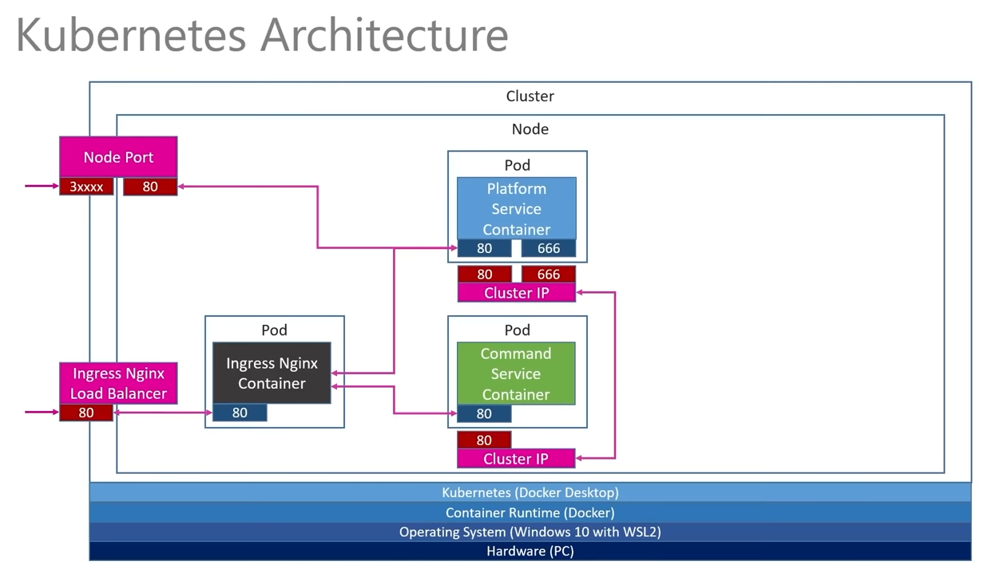
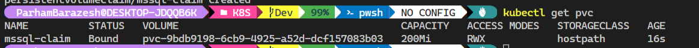

# Tech used in this tutorial:

## 1. Command Service

## 2. Scaffolding

## 3. Controller & Action

## 4. Synchronous & Asynchoronous Messaging

## 5. Adding a HTTP Client

## 6. Deploy Service to Kubernetes

## 7. Internal Networking

## 8. API Gateway

<br>

# SQL Server

## 1. Persistent Volume Claims

## 2. Kubernetes Secrets

## 3. Deploy SQL Server to Kubernetes

## 4. Revisit Platform Service

<br>

# Multi-Resource API

## 1. Review of Endpoints for Command Service

## 2. Data Layer

## 3. Controller & Actions

<br>

# Message Bus / RabbitMQ

## 1. Solution Architecture Review

## 2. RabbitMQ Overview

## 3. Deploy RabbitMQ to Kubernetes

## 4. Test

<br>

# Asynchronous Messaging

## 1. Adding a Message Bus Publisher to Platform Service

## 2. Event Processing

## 3. Adding an Event Listner to the Commands Service

<br>

# GRPC

## 1. Overview of GRPC

## 2. Final Kubernetes Networking

## 3. Adding gRPC server to Platform Service

## 4. Creating a "proto" file

## 5. Adding a gRPC client to the Command Service

## 6. Deploy and Test

<hr><hr><hr><br>

# Mircoservices

Microservices are designed to do one thing well while talking to other microservices. They are self-contained and autonomous. They are small and decoupled (easier to change and deploy). Resilient, one service breaks, the system continues to work. Scalable, you can scale only the services you need. They share data, but not the same database.`<br><br>`
A Monolith CRM system is very difficult to change (months of time with massive amount of manual testing), difficult to scale (you can scale but you need to scale the whole system). And they are locked in to the tech stack, making it difficult to change the tech. One part breaks, the whole system goes down.`<br><br>`


## In this tutorial we build 2 services:

<ol>
    <li>
        Platform Service
    </li>
    <ul>
        <li>
            Functions as an "Asset Register"
        </li>
        <li>
            Track all the platforms/systems in the company
        </li>
        <li>
            Built by the Infrastructure team
        </li>
        <li>
            Used by: Infrastructure, Tech support, Engineering, Accounting, Procurement teams
        </li>
    </ul>
</ol>
<ol>
    <li>
        Command Service
    </li>
    <ul>
        <li>
            Functions as a repository of command line augments for given Platforms
        </li>
        <li>
            Aid in the automation of support processes
        </li>
        <li>
            Built by the tech support team
        </li>
        <li>
            Used by: Tech support, Insfrastructure, Engineering teams
        </li>
    </ul>
</ol>
<br><br>


`<br><br>`

# Docker

**To build your image into docker, after making the dockerfile run:**

```
docker build -t parhambrz/platformservice .

```

**To run the docker image:**

```
docker run -p 8080:80 -d parhambrz/platformservice

```

-p: map port 8080 on docker to port 80 on local machine. This port can be used in the APIs like:

```
http://localhost:8080/api/platforms
```

-d: detached. You can then use terminal instead of seeing container logs.
**To show the list of running containers:**

```
docker ps

```

This gives a list of running containers with id. You can use the id to stop the container:

```
docker stop CONTAINER_ID

```

If you run the same image with "docker run ..." a new container will be created based on that image. To start the same stopped container run:

```
docker start CONTAINER_ID

```

**To push the image to DockerHub:**

```
docker push parhambrz/platformservice
```

In case you got error of push denied: Request access to the source is denied, you should login to docker using:

```
docker login
```

Then login with your dockerhub username and password.

# Kubernetes

One cluster can have multiple nodes.
Pod can run multiple containers. Pod is to host and run containers. Pod is the first level object we work with.
Node Port is the first k8s service used only in development to access to the pods from outside.
Cluster IP is used by the pods to talk to each other.
Load Balancer(Nginx) is another K8S service.
Persistent Volume Claim is used to claim some storage on physical device. e.g. the databases running in docker can store their data in PVC.

## Kubernetes Architecture of the tutorial:


**To run the application in Kubernetes:**

1. Create .yaml file (we created platform-depl.yaml)

   ```
   apiVersion: apps/v1
   kind: Deployment
   metadata:
     name: platform-depl
   spec:
     replicas: 1
     selector:
       matchLabels:
         app: platformservice
     template:
       metadata:
         labels:
           app: platformservice
       spec:
         containers:
           - name: platformservice
             image: parhambrz/platformservice:latest
   ```
2. Run:

```
kubectl apply -f platform-depl.yaml
```

**This will create a deployment. To get all deployments:**

```
kubectl get deployments
```

**To get all pods:**

```
kubectl get pods
```

After applying the yaml file two containers will show in Docker Desktop. One is for the Pod and the other is the actual container running your application. If you remove the application container, kubernetes will autocreate that. That's the whole point of Kubernetes.

**To Delete a deployment named "platform-depl"**

```
kubectl delete deployment platform-depl
```

This will delete the attached pods to the deployment as well.

**NodePorts:**

NodePort is used to give external access to our service.

How to create?

NodePort is a **Servic****e**

1. Create .yaml file for NodePort Service (we create platforms-np-srv.yaml)

   ```
   apiVersion: v1
   kind: Service
   metadata:
     name: platformnpservice-srv
   spec:
     type: NodePort
     selector:
       app: platformservice
     ports:
       - name: platformservice
         protocol: TCP
         port: 80
         targetPort: 80
   ```
2. Run:

```
kubectl apply -f platforms-np-srv.yaml
```

**To get all services:**

```
kubectl get services
```

How to access the service from outside?

1. run kubectl get services. the result will be something like:

   
2. port 31822 is the port to use to access the service from outside. it is mapped to the port 80 inside the container.

# **Create CommandsService project:**

To create

```
dotnet new webapi -n CommandsService --framework net5.0
```

-n: name of the project

--framework: .NET framework to use. if skipped the latest version will be selected (now .NET 6).

# Messaging:

Synchronous Messaging:

1. Request/Response cycle.
2. As a client I make a request to HTTP endpoint and wait to get the response.
3. Externally facing services usually are synchronous, e.g. HTTP requests.
4. Synchronous services usually need to know each other, technically know the endpoint to the service we are requesting.
5. In this tutorial we use 2 forms of synchronous messaging:
   5.1. HTTP
   5.2. gRPC

Question: Does this async shows Http methods are asynchronous?


Answer: No. Why?

1. From the messaging perspective this method is still synchronous.
2. Any client making a request to that endpoint still should wait for a response.
3. async in this context meant that the operation will not wait for a long running operation and will return the thread back to the thread pool so it can be reused.
4. When the opration finishes, it will re-acquire a thread and complete, and responds back to the requester.
5. This async is internally for the service management and thread exhaustion. but the call is still synchronous and the requestor has to wait!
6. It's a pure c# thing. nothing to do with the messaging.

## Synchronous messaging between the services:

1. Can and does occur
2. It tends to pair services (couple them) creating a dependency
3. Could lead to long dependency chain

Note: In microservice architecture we don't want a chatty communication between services. They still need to communicate to each other, but the intention is to minimize it. And we usually don't want the inter-service communication to be synchronous.


This diagram shows synchronous communication between multiple services. In case of failure of one of the services, the entire chain may loose connection or have to wait a long time which is not desirable.

# Asynchronous Messaging:

1. There is no request/response cycle
2. Requestor does not wait for the response
3. It uses an Event model like Publish Subscribe
4. Typically used between services
5. An Event Bus is often used (we use RabbitMQ)
6. Services don't need to know about each other. They know the bus.


Question: Is Event Bus Monolith?

1. To some extent yes. If the Message bus fails, the internal communications will stop. So the microservices should be written in the case they can deal with such conditions.
2. Services will still operate and work externally.
3. Message bus is so important and should be treated as a first class cirizen. It should be clustered with message persistent, fault tolerance, etc. message persistent is for the case the Message Bus fails and the cluster restarts, it brings the ability to queue the messages so they are not lost.
4. Services should implement retry policy. So if Message bus fails it retries the requests and does not lose the events.

**Fix: If there is an error with the SSL certificates not recognized:**

Error Description:

The SSL connection could not be established, see inner exception.

The remote certificate is invalid because of errors in the certificate chain: UntrustedRoot

How to fix?

```
dotnet dev-certs https --trust
```

After creating the CommandService project, dockerize it with the same Dockerfile as platform service. just change the EntryPoint to the correct dll file.

```
FROM mcr.microsoft.com/dotnet/sdk:6.0 AS build-env
WORKDIR /app
COPY *.csproj ./
RUN dotnet restore
COPY . ./
RUN dotnet publish -c Release -o out

#This image is the runtime
FROM mcr.microsoft.com/dotnet/aspnet:6.0
WORKDIR /app
#build-env is the other image we got
COPY --from=build-env /app/out/ .
#Set the entry point for out image
ENTRYPOINT ["dotnet","CommandsService.dll"]
```

To build the docker image:

```
docker build -t parhambrz/commandservice .
```

To push the image to dockerhub:

```
docker push parhambrz/commandservice
```

To run the container:

```
docker run -p 8080:80 parhambrz/commandservice
```

## ClusterIP:

ClusterIP is a service providing a way that dofferent containers can comminicate internally. For accessing the outside world we use NodePort.

Add this lines to platforms-depl.yaml to set the ClusterIP:

```
apiVersion: v1
kind: Service
metadata:
  name: platforms-clusterip-srv
spec:
  type: ClusterIP
  selector: 
    app: platformservice
  ports:
    - name: platformservice
      protocol: TCP
      port: 80
      targetPort: 80
```

Then run:

```
kubectl apply -f platform-depl.yaml
```

**If there are running deployments, there will be no change to them. only the new deployments or services will run. So you can safely add more services to a .yaml file and run kubectl apply -f filename.**

**Note:** One of the problems with synchronous data services is that we need to know the endpoints.

To restart a deployment:

```
kubctl rollout restart deployment DEPLOYMENT_NAME
```

## Ingress:

**install Ingress from https://kubernetes.github.io/ingress-nginx/deploy/#docker-desktop
**

Note:

To get the namespaces run:

```
kubectl get namespaces
```

Ingress will setup containers in a different namespace. To get the pods/services/etc in a specific namespace run:

```
kubectl get pods --namespace=NAMESPACE_NAME
```

**Add Ingress config file:**

```
apiVersion: networking.k8s.io/v1
kind: Ingress
metadata:
  name: ingress-srv
  annotations:
    kubernetes.io/ingress.class: nginx
    nginx.ingress.kubernetes.io/use-regex: "true"
spec:
  rules:
  - host: acme.com
    http:
      paths:
      - path: /api/platforms
        pathType: Prefix
        backend:
          service:
            name: ingress-srv
            port:
              number: 80
      - path: /api/platforms
        pathType: Prefix
        backend:
          service:
            name: commands-clusterip-srv
            port:
              number: 80
```

Now add "127.0.0.1 acme.com" to hosts file in c:/Windows/System32/drivers/etc. This will map the address.

then run:

```
kubectl apply -f ingress-srv.yaml
```

You can now query this url: "http://acme.com:31822/api/platforms" to get the data.

Note: the port changes by the docker container. read it from "kubectl get services"

until now the app architecture is like:



## Persistent Volume Claim (PVC):

To get storage class run:

```
kubectl get storageclass
```

PVC will map a storage to some parts of the storage on the local machine.

The config file to create PVC (here we create local-pvc.yaml):

```
apiVersion: v1
kind: PersistentVolumeClaim
metadata:
  name: mssql-claim
spec:
  accessModes:
    - ReadWriteMany
  resources:
    requests:
      storage: 200Mi
```

To apply the PVC run:

```
kubectl apply -f local-pvc.yaml
```

To get the PVCs run:

```
kubectl get pvc
```

The result will be something like:



which refers to "hostpath" as storageclass.

**Now we set up SQL server:**

Note:

SQL requires to set up a service password. To set that up in Kubernetes run:

```
kubectl create secret generic _SECRET_NAME --from-literal=_KEY="_VALUE"
```

here is the config file for the mssql setup including clusterip and load balancer (named mssql-plat-depl.yaml):

```
apiVersion: apps/v1
kind: Deployment
metadata:
  name: mssql-depl
spec:
  replicas: 1
  selector:
    matchLabels:
      app: mssql
  template:
    metadata:
      labels:
        app: mssql
    spec:
      containers:
        - name: mssql
          image: mcr.microsoft.com/mssql/server:2017-latest
          env:
            - name: MSSQL_PID
              value: "Express"
            - name: ACCEPT_EULA
              value: "Y"
            - name: SA_PASSWORD
              valueFrom:
                secretKeyRef:
                  name: mssql
                  key: SA_PASSWORD
          volumeMounts:
            - name: mssqldb
              mountPath: /var/opt/mssql/data
          ports:
              containerPort: 1433
      volumes:
        - name: mssqldb
          persistentVolumeClaim:
            # This is the name of the PVC created in the previous step (see K8S\local-pvc.yaml)
            claimName: mssql-claim
---
# setup clusterip
apiVersion: v1
kind: Service
metadata:
  name: mssql-clusterip-srv
spec:
  type: ClusterIP
  selector:
    app: mssql
  ports:
    - name: mssql
      protocol: TCP
      port: 1433
      targetPort: 1433
---
# setup load balancer
apiVersion: v1
kind: Service
metadata:
  name: mssql-loadbalancer
spec:
  type: LoadBalancer
  selector:
    app: mssql
  ports:
  - protocol: TCP
    port: 1433
    targetPort: 1433

```
